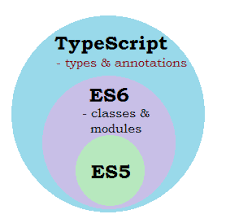

# TypeScript范型介绍及应用

最近在项目中使用到了TypeScript语言，其强大的类型系统让人印象深刻。本文将系统性的给大家介绍Typescript类型系统中最重要的一种泛型。

## TypeScript介绍
首先给大家介绍一下TypeScript：
TypeScript 是一种由微软开发的自由和开源的编程语言。它是 JavaScript 的一个超集，而且本质上向这个语言添加了可选的静态类型和基于类的面向对象编程。
下图显示了TypeScript 与 ES2015 和 ES2016 之间的关系：




## Generics 什么是泛型
在软件工程中最主要的部分是不仅仅构建具有定义明确、一致性的API组件，最重要的是可重复使用。这些组件既可以处理今天的数据也可以适配明天的数据。这种可以适配不同类型的数据的开发范式将为构建大型软件系统提供最灵活的功能。

在其他编程语言中如C#或java中，用于创建可重复使用组件的工具箱中最主要的工具就是泛型。泛型可以创建一个可以处理多种数据类型的组件，而不仅仅是单一数据类型。在Typescript中同样也提供了泛型这种开发范式。

### Generics 泛型使用
接下来我们将具体介绍泛型在TypeScript中如何运用：

### Generics  type alias 泛型类型别名
定义了一个任务类型，他拥有属性名称对应的属性值类型是string，年龄属性对应的属性值类型是number以及爱好属性对应的属性值类型是一个泛型数组 T[]，其中T的具体类型将根据定义变量时传入的类型确认。

```js
type PersonType<T> = {
    name: string
    age: number
    hobby： T[]
}

// 定义一个人小红 年龄 18 兴趣爱好 是篮球 足球 
// T是string
const xiaohong： PersonType<string> = {
   name: 'xiaohong',
   age: 18,
   hobby: [
       'basketball',
       'football'
   ]
}
```

### Generics  interface 泛型接口
泛型接口的使用与上面的泛型类型别名的定义一致。注意当有多个泛型变量时的语法格式。

```js
interface 接口名称<T1, T2, T3....> {
    property1：T1
    property2：T2
    property3：T3
    ...
}
```
我们将PersonType中的所有类型全部变为，虽然这样做没有任何意义只是为了演示语法格式。
```js
interface PersonType<T1, T2, T3> = {
    name: T1
    age: T2
    hobby：T3
}

// 定义一个人小红 年龄 18 兴趣爱好 是篮球 足球 
// T1是string T2是number T3是string
const xiaohong： PersonType<string, number, string> = {
   name: 'xiaohong',
   age: 18,
   hobby: [
       'basketball',
       'football'
   ]
}
```
### Generics function 泛型函数
在介绍泛型函数之前，我们有必要先结合在Typescript中定义函数类型的方式来展开介绍：
- 基本的定义方法 可以使用类型别名或直接写类型注释来声明泛型函数

```js
type IdentityType = <T>(arg: T) => T

function identity<T>(arg: T): T {
    return arg
}

// 直接写类型
let myIdentity: <T>(arg: T) => T = identity
// 类型别名的方式
let myIdentity1: IdentityType = identity
```
- 调用签名call Signatures
```js
类型
type IdentityType = {
    <T>(arg: T): T
}
```
- 构造函数签名 Construct Signatures

```js
type SomeConstructor = {
  new <T>(arg: T): someObject;
};
```

### Generics  class 泛型类

就像接口一样，将类型参数放到类本身上可以让我们确保类的所有属性都有相同的类型。

```js
class AxiosError<T = unknown, D = any> extends Error {
  constructor(
    message?: string,
    code?: string,
    config?: AxiosRequestConfig<D>,
    request?: any,
    response?: AxiosResponse<T, D>
  );

  config?: AxiosRequestConfig<D>;
  code?: string;
  request?: any;
  response?: AxiosResponse<T, D>;
  isAxiosError: boolean;
  status?: number;
  toJSON: () => object;
  cause?: Error;
  static readonly ERR_FR_TOO_MANY_REDIRECTS = "ERR_FR_TOO_MANY_REDIRECTS";
  static readonly ERR_BAD_OPTION_VALUE = "ERR_BAD_OPTION_VALUE";
  static readonly ERR_BAD_OPTION = "ERR_BAD_OPTION";
  static readonly ERR_NETWORK = "ERR_NETWORK";
  static readonly ERR_DEPRECATED = "ERR_DEPRECATED";
  static readonly ERR_BAD_RESPONSE = "ERR_BAD_RESPONSE";
  static readonly ERR_BAD_REQUEST = "ERR_BAD_REQUEST";
  static readonly ERR_NOT_SUPPORT = "ERR_NOT_SUPPORT";
  static readonly ERR_INVALID_URL = "ERR_INVALID_URL";
  static readonly ERR_CANCELED = "ERR_CANCELED";
  static readonly ECONNABORTED = "ECONNABORTED";
  static readonly ETIMEDOUT = "ETIMEDOUT";
}
```
需要注意的是类的类型有两个方面： 实例方面与静态方面。泛型类仅在其实例端而非静态端是泛型的，因此在使用类时，静态成员不能使用类的类型参数。如下例：

```js
class GenericNumber<NumType> {
  // 实例属性
  zeroValue: NumType;
  // 实例方法
  add: (x: NumType, y: NumType) => NumType;

  // 静态属性
  static FLAG = true
  // 静态方法
  static printFlag: () => void
}
 
let myGenericNumber = new GenericNumber<number>();
myGenericNumber.zeroValue = 0;
myGenericNumber.add = function (x, y) {
  return x + y;
};

GenericNumber.FLAG = false
GenericNumber.printFlag = function () {
  console.log(GenericNumber.FLAG )
}
```

### 范型变量的约束

从了上述常见**T**作为范型变量，作为公约我们还有如下的约定：

- T 全场 Type 表示typescript中的类型；
- K 全称 Key 表示对象中键的类型；
- V 全称 Value 表示对象中值的类型；
- E 全称 Element 表示元素类型。

当然你也可以用任意变量表示范型，引入任意个数的范型变量。如下例子引入一个新的类型变量 U，用于扩展我们定义的 identity 函数。


### 泛型工具介绍

typescript提供了一些有用的类型工具来帮助开发者实现类型转换，同时这些类型是全局可用的。

#### Partial<type>
将type中的所有属性都变为可选的

原理：

```js
type Partial<T> = {
    [P in keyof T]?: T[P] | undefined
}
```

示例：

```js
interface Todo {
  title: string;
  description: string;
}

const fieldsToUpdate: Partial<Todo> = {
    title: 'alex'
}

// 虽然这样做毫无意义
const emptyObj: Partial<Todo> = {}
```

#### Required<Type>

将type中的所有属性都变为必要的

原理：

```js
type Required<T> = {
    [P in keyof T]-?: T[P]
}
```

示例：

```js
interface Props {
  a?: number;
  b?: string;
}
 
const obj: Props = { a: 5 };
 
// error 差属性b
const obj2: Required<Props> = { a: 5 };
```

#### Readonly<Type>

将type中的所有属性都变为只读

原理：

```js
type Required<T> = {
    readonly [P in keyof T]-?: T[P]
}
```

示例：

```js
interface Todo {
  title: string;
}
 
const todo: Readonly<Todo> = {
  title: "Delete inactive users",
};

// error todo对象的title属性不能被修改
todo.title = 'xxxxx'
```

#### Record<Keys, Type>

将对象里的属性类型设置为Keys的类型，将属性值的类型设置为Type类型

原理：

```js
type Record<k extends string | number | symbol, T> = {
    [P in K]: T
}
```

示例：

```js
const obj: Record<string, string> = {
    name: 'alex',
    sex: 'man'
}


interface CatInfo {
  age: number;
  breed: string;
}
 
type CatName = "miffy" | "boris" | "mordred";
 
const cats: Record<CatName, CatInfo> = {
  miffy: { age: 10, breed: "Persian" },
  boris: { age: 5, breed: "Maine Coon" },
  mordred: { age: 16, breed: "British Shorthair" },
};
```

#### Pick<Type, Keys>

从type中挑选出对应的属性（Keys是属性字符串组成的字符串字面量集合）并组成新的类型

原理：

```js
type Pick<T, K extneds keyof T> = {
    [P in K]: T[P]
}
```

示例：

```js
interface Todo {
  title: string;
  description: string;
  completed: boolean;
}

// 从Todo接口中挑选title属性与completed属性
type TodoPreview = Pick<Todo, "title" | "completed">;

const todo: TodoPreview = {
  title: "Clean room",
  completed: false,
};
```

#### Omit<Type, Keys>

从type中挑移除对应的属性（Keys是属性字符串组成的字符串字面量集合）并组成新的类型

原理：

```js
type Omit<T, K extends string | number | symbol> = { [P in Exclude<keyof T, K>]: T[P]; }
```

示例：

```js
interface Todo {
  title: string;
  description: string;
  completed: boolean;
  createdAt: number;
}

// 从接口中移除completed与createdAt属性
type TodoInfo = Omit<Todo, "completed" | "createdAt">;
 
const todoInfo: TodoInfo = {
  title: "Pick up kids",
  description: "Kindergarten closes at 5pm",
};
```

#### Exclude<UnionType, ExcludedMembers>

从联合类型UnionType中排除ExcludedMembers形成新的类型

原理：

```js
type Exclude<T, U> = T extends U ? never : T
```

示例：

```js
type T0 = Exclude<"a" | "b" | "c", "a">;

// type T0 = "b" | "c"
```

#### Extract<Type, Union>

从联合类型UnionType中抽取Union中共有的类型并形成新的类型

原理：

```js
type Extract<T, U> = T extends U ? T : never
```

示例：

```js
type T0 = Extract<"a" | "b" | "c", "a" | "f">;

// type To = "a"
```

#### NonNullable<Type>

从type中排出null 与undefined类型

原理：

```js
type NonNullable<T> = Exclude<T, null | undefined>
type NomNullable<T> = T & {}
```

示例：

```js
type T0 = NonNullable<string | number | undefined>;
     
// type T0 = string | number
```


## 总结

##  参考

- [typescript handbook](https://www.typescriptlang.org/docs/handbook/typescript-from-scratch.html)
- [接近天花板的TS类型体操，看懂你就能玩转TS了
](https://juejin.cn/post/7061556434692997156)
- [【动画演示】TypeScript 泛型中的 K、T、V 等到底是个啥？](https://juejin.cn/post/7084410879223005215)